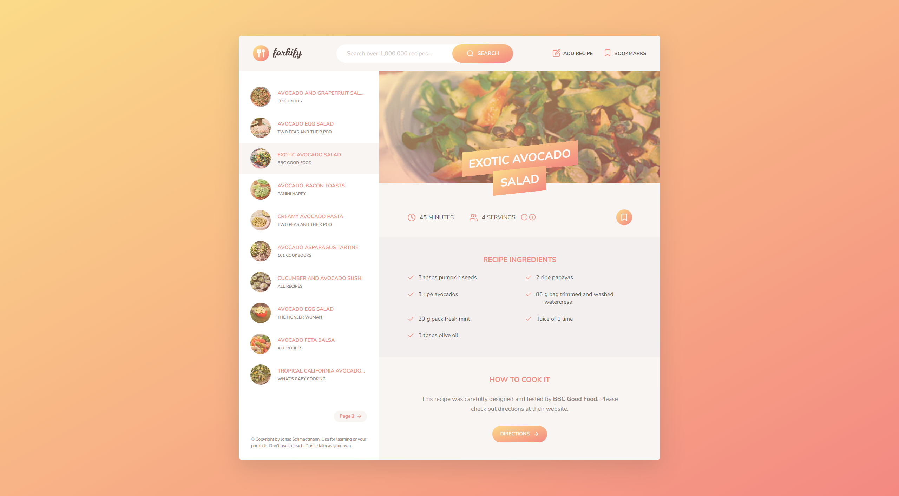

# Forkify App 

## Description

Forkify is a recipe search built with HTML5, CSS3, and JavaScript. It features an intuitive user interface and dynamic serving size adjustment. The app uses advanced JavaScript concepts like asynchronous programming, ES6 modules, and object-oriented programming following the MVC (MODEL - VIEW - CONTROLLER) Pattern. Forkify was created by Jonas Smechmann in his Udemy course (https://www.udemy.com/course/the-complete-javascript-course/) and this app was built as part of a personal project to learn JavaScript.
## Features
 * Search and browse an extensive collection of recipes.
 * Implement paginations if there are more than 10 recipes generated ofr a search
 * View detailed recipe information, including ingredients, instructions, and serving sizes.
 * Update the serving details (increase or decrease the servings).
 * Interactive and intuitive user interface.

## Technologies Used
 * HTML
 * CSS/Sass
 * JavaScript
 * Parcel (for bundling and building)
 * Babel (for JavaScript compilation)
 * Fraction.js (for handling fractions in ingredient quantities) - was later removed due to conflict with Netlify 
